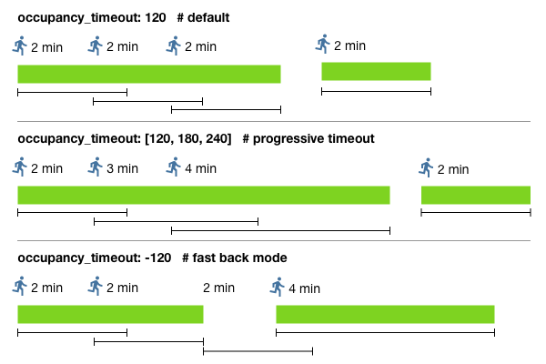
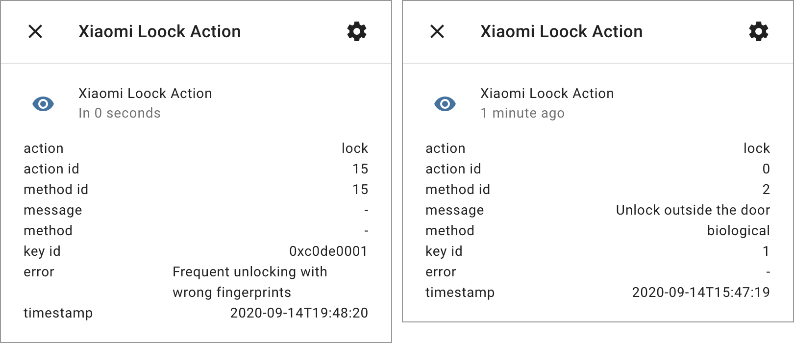

# Xiaomi Gateway 3 for Home Assistant

[](https://github.com/hacs/integration)

Home Assistant custom component for control **Xiaomi Multimode Gateway** (aka Gateway 3), **Xiaomi Multimode Gateway 2**, **Aqara Hub E1** on default firmwares over LAN.

| Gateway                         | Model      | Supported         |
|---------------------------------|------------|-------------------|
| Xiaomi Multimode Gateway (CN)   | ZNDMWG03LM | **supported**     |
| Xiaomi Multimode Gateway (EU)   | ZNDMWG02LM | **supported**     |
| Xiaomi Multimode Gateway 2 (CN) | DMWG03LM   | **supported**     |
| Xiaomi Multimode Gateway 2 (EU) | ZNDMWG04LM | **supported**     |
| Aqara Hub E1 (CN)               | ZHWG16LM   | **supported**     |
| Xiaomi Gateway 2 (CN)           | DGNWG02LM  | **no**, [goto][1] |
| Xiaomi Gateway (EU)             | DGNWG05LM  | **no**, [goto][2] |
| Aqara Hub E1 (EU), Aqara G2H (CN), Aqara H1 (CN), Aqara M1S (CN), Aqara M2 (CN), Aqara P3 (CN) | HE1-G01, ZNSXJ12LM, QBCZWG11LM, ZHWG15LM, ZHWG12LM, KTBL12LM | **no**, [goto][3] |

[1]: https://www.home-assistant.io/integrations/xiaomi_aqara/
[2]: https://openlumi.github.io/
[3]: https://github.com/niceboygithub/AqaraGateway

Thanks to [@Serrj](https://community.home-assistant.io/u/serrj-sv/) for [instruction](https://community.home-assistant.io/t/xiaomi-mijia-smart-multi-mode-gateway-zndmwg03lm-support/159586/61) how to enable Telnet on old firmwares. And thanks to an unknown researcher for [instruction](https://gist.github.com/zvldz/1bd6b21539f84339c218f9427e022709) how to open telnet on new firmwares.

---

* [Supported Firmwares](#supported-firmwares)
* [Supported Devices](#supported-devices)
  * [Add new device](#add-new-device) 
* [Installation](#installation)
* [Configuration](#configuration)
* [Network configuration](#network-configuration)
* [Regional Restrictions](#regional-restrictions)
* [Statistics table](#statistics-table)
* [Gateway controls](#gateway-controls)
* [Advanced config](#advanced-config)
  * [Integration config](#integration-config)
  * [Devices config](#devices-config)
  * [Entities customize](#entities-customize)
* [Zigbee Home Automation Mode](#zigbee-home-automation-mode)
* [Zigbee2MQTT Mode](#zigbee2mqtt-mode)
* [Zigbee custom firmware](#zigbee-custom-firmware)
* [Handle Button Actions](#handle-button-actions)
* [Handle BLE Locks](#handle-ble-locks)
* [Obtain Mi Home device token](#obtain-mi-home-device-token)
* [Multiple Hass](#multiple-hass)
* [Disable Buzzer](#disable-buzzer)
* [How it works](#how-it-works)
* [Troubleshooting](#troubleshooting)
* [Debug mode](#debug-mode)
* [FAQ](#faq)
* [Useful links](#useful-links)

## Supported Firmwares

Component support original gateway firmwares. It's important to obtain and secure save the **Gateway Key**.

- Integration can easily get the key on older firmwares
- Integration can get a key if you connected the gateway to it on old firmware and accidentally upgraded to the new firmware
- You need to use UART if you have a new gateway with new firmware

For this gateway firmwares you needs only Gateway IP and MiHome token:

- **Xiaomi Multimode Gateway CN/EU** from `1.5.0_xxxx` to `1.5.4_xxxx`
- **Xiaomi Multimode Gateway 2 CN/EU** from `1.0.3_xxxx` to `1.0.6_xxxx`
- **Aqara Hub E1 CN** - `4.0.1_0001`

For this gateway firmwares you needs Gateway IP, MiHome token and **Gateway Key**:

- **Xiaomi Multimode Gateway CN/EU** from `1.5.5_xxxx` to `1.5.6_xxxx`, [read more](https://github.com/AlexxIT/Blog/issues/13)
- **Xiaomi Multimode Gateway 2 CN/EU** - `1.0.7_xxxx`, [read more](https://github.com/AlexxIT/XiaomiGateway3/issues/1166#issuecomment-1896071291)

For Xiaomi Multimode Gateway you can:

- optional update firmware via [Telnet](https://github.com/zvldz/mgl03_fw/tree/main/firmware)
- optional install [custom firmware](https://github.com/zvldz/mgl03_fw/tree/main/firmware)

Please, not ask me why you need it.

## Supported Devices

Gateway Zigbee chip can work in three modes:

**1. Mi Home (default)**

   - Support Xiaomi/Aqara Zigbee devices simultaneously in Mi Home and Hass
   - Support some Zigbee devices from other brands only in Hass
   
**2. Zigbee Home Automation (ZHA)**

   - Support for [Zigbee devices of hundreds of brands](https://zigbee.blakadder.com/zha.html) only in Hass ([read more](#zigbee-home-automation-mode))

**3. Zigbee2mqtt**

   - Support for [Zigbee devices of hundreds of brands](https://www.zigbee2mqtt.io/supported-devices/) in MQTT ([read more](#zigbee2mqtt-mode))

Zigbee devices in ZHA or z2m modes doesn't controlled by this integration!

Xiaomi BLE and Mesh devices works simultaneously in Mi Home and Hass. No matter which zigbee mode is used.

Other Zigbee, BLE and Mesh devices not from the list below also may work with limited support of functionality. 

Some BLE devices have no known default entities (asterisk in the list). Their entities appear when receiving data from the devices.

Some BLE devices may or may not have battery data depending on the device firmware.

Gateway entity shows connection state to gateway. It has many useful information in attributes.

Zigbee and BLE devices has optional `zigbee` and `ble` that shows `last_seen` time in state and may useful intormation in attributes.

### Add new device

You can change the operation of an existing device or add support for any **Xiaomi Zigbee**, **Xiaomi BLE**, **Xiaomi Mesh** or any **other brand Zigbee** device by writing an [external converter](https://github.com/AlexxIT/XiaomiGateway3/wiki/Converters).

It is welcomed if you return a working converter to integration. You can create an issue or make a pull request.

## Installation

[HACS](https://hacs.xyz/) > Integrations > Plus > **XiaomiGateway3** > Install

Or manually copy `xiaomi_gateway3` folder from [latest release](https://github.com/AlexxIT/XiaomiGateway3/releases/latest) to `/config/custom_components` folder.

## Configuration

[Settings](https://my.home-assistant.io/redirect/config/) > [Integrations](https://my.home-assistant.io/redirect/integrations/) > Add Integration > [Xiaomi Gateway3](https://my.home-assistant.io/redirect/config_flow_start/?domain=xiaomi_gateway3)

If the integration is not in the list, you need to clear the browser cache.

You need to add integration two times:

1. Cloud version. It used ONLY to load tokens and names for your devices from cloud.
2. Gateway. It adds your gateway and all connected Zigbee, BLE and Mesh devices.

You may skip 1st step if you know token for you Gateway. If you have multiple Gateways - repeat step 2 for each of them.

You need gateway `key` only for Xiaomi Multimode Gateway on fw 1.5.5, [read more](https://github.com/AlexxIT/Blog/issues/13).

**ATTENTION:** If you using two Hass with one gateway - you should use same integration version on both of them! 

## Network configuration 

All settings are **important** or you may have an unstable operation of the gateway.

- **Shared LAN** between Gateway and Hass server. You may use VPN, but both IP-address should be in **same network subnet**!
- **Open ping** (accept ICMP) from Gateway to Router
- **Fixed IP-address** for Gateway on your Router
- Wi-Fi Router settings:
   - **Fixed channel** from 1 to 11
   - Channel width: **20MHz** (don't use 40MHz)
   - Authentication: WPA2 (don't use WPA3)
- MikroTik Router settings:
   - Wireless > Security Profiles > Group Key Update: **01:00:00** (1 hour or more)
- Keenetic Router settings: 
   - Disable "[Airtime Fairness](https://help.keenetic.com/hc/en-us/articles/360009149400)" for 2.4GHz
   - Disable "[256-QAM](https://help.keenetic.com/hc/en-us/articles/4402854785170)" for 2.4GHz

With the following settings the operation of the gateway may be **unstable**: different subnets, closed ping to router, Wi-Fi channel 40MHz, WPA3.

## Regional Restrictions

| Device                              | MiHome EU   | MiHome CN | Vevs EU   | Vevs CN     |
|-------------------------------------|-------------|-----------|-----------|-------------|
 | Gateway 3 (CN and EU)               | supported   | supported | supported | supported   |
 | Zigbee old series                   | supported   | supported | supported | supported   |
 | Zigbee E1 series (CN and EU)        | no          | supported | no        | supported   |
 | Zigbee H1 and T1 series (CN and EU) | no          | partially | no        | some models |
 | Bluetooth BLE and Mesh              | some models | supported | supported | supported   |

**Xiaomi Mijia Smart Multi-Mode Gateway** has two models - `ZNDMWG03LM` (China) and `ZNDMWG02LM`/`YTC4044GL` (Euro). Both this models can be added to China or to Euro cloud servers.

**PS.** This is the ONLY Xiaomi/Aqara gateway that has the same internal model for the China and Euro versions - `lumi.gateway.mgl03`. So the Hass component and the Xiaomi cloud servers see no difference between the models.

Most **older Xiaomi/Aqara Zigbee devices** can also be added to China and to Euro cloud servers.

New **Zigbee devices from E1 series** can be added ONLY to China cloud servers. They supported in official Mi Home application.

New **Zigbee devices from H1 and T1 series** are not officially supported in Mi Home. But they can be added ONLY to China cloud servers. You can controll them from Hass (check supported list) but not from stock Mi Home application. Some of this model (mostly H1 switches and T1 relays) can be controlled from [Mi Home by Vevs](https://www.kapiba.ru/2017/11/mi-home.html).

Some of **Bluetooth BLE and Mesh** can be added ONLY to China cloud. But with [Mi Home by Vevs](https://www.kapiba.ru/2017/11/mi-home.html) they can be added to any cloud.

**PS.** You can't add **Zigbee devices E1/H1/T1** to Euro cloud even with **Mi Home by Vevs**.

If you control your devices from Home Assistant - it makes absolutely no difference which cloud they are added to. Devices are controlled locally and without delay in any case.

**PS.** Some Aqara devices are not supported at all in Mi Home in any version, e.g. **Aqara Door Lock N100 Zigbee version**.

## Multiple Gateways

Integration support multiple gateways in one MiHome account.

Zigbee devices can be attached (paired) to only one gateway. I recommend to split your Zigbee network into several gateways, so it will be more stable. I recommend not to mix battery and powered devices in the same network.

Bluetooth BLE and Mesh devices can work simultaneously with all gateways. In this technology, there is no binding to the gateway.

If a user has more than one Bluetooth Mesh Gateway on the network - only one will send Bluetooth device data to the cloud. But this integration can continue to collect Bluetooth data from all gateways simultaneously and locally.

## Statistics table


1. To enable stats sensors go to:
   - [Settings](https://my.home-assistant.io/redirect/config/) > [Integrations](https://my.home-assistant.io/redirect/integrations/) > Xiaomi Gateway 3 > Options > Add statistic sensors

2. Install [Flex Table](https://github.com/custom-cards/flex-table-card) from HACS

3. Add new Lovelace tab with **Panel Mode**

4. Add new Lovelace card:
   - [example 1](https://gist.github.com/AlexxIT/120f20eef4f39071e67f698207490db9)
   - [example 2](https://github.com/avbor/HomeAssistantConfig/blob/master/lovelace/views/vi_radio_quality_gw3.yaml)

**Gateway binary sensor**

- sensor shows connection to gateway, so you can check the stability of your Wi-Fi
- **radio_tx_power** - zigbee chip power
- **radio_channel** - zigbee chip channel
- **free_mem** - gateway free memory in bytes
- **load_avg** - gateway CPU `/proc/loadavg`
- **rssi** - gateway Wi-Fi signal strength
- **uptime** - gateway uptime after reboot

Read more about additional attributes from [openmiio](https://github.com/AlexxIT/openmiio_agent#openmiioreport). 

**Zigbee sensor**

- sensor shows time of receiving the last message from this device
- **ieee** - zigbee device "long" address
- **nwk** - zigbee device "short" address
- **available** - device available state
- **parent** - `0xABCD` if device connected to zigbee router or `-` if device connected to gateway or `?` for unknown parent 
- **type** - zigbee `router` or end `device` or `?` for unknown type
- **msg_received** - amount of messages received from the device
- **msg_missed** - amount of unreceived messages from the device, calculated using the sequence number of messages
- **linkquality** - zigbee signal quality, below 100 is very weak
- **rssi** - zigbee signal quality, no recommendations
- **last_msg** - type of last received message
- **new_resets** - the number of device reboots since Hass reboot, supported in some Xiaomi/Aqara devices

**BLE and Mesh sensor**

- sensor shows time of receiving the last message from this device
- **mac** - device MAC address
- **available** - device available state
- **msg_received** - amount of messages received from the device
- **last_msg** - type of last received message

## Gateway controls

The old version of integration used two switches, pair and firmware_lock. If you still have them after the upgrade, remove them manually.

The new version has two drop-down lists (select entities) - command and data.

Available commands:

- **Zigbee pairing** - start the process of adding a new zigbee device
   - you can also start the process by pressing the physical button on the gateway three times
   - you can also start the process from the Mi Home app
- **Zigbee binding** - configure the bindings of zigbee devices, only if they support it
- **Zigbee OTA** - try to update the zigbee device if there is firmware for it
- **Zigbee reconfig** - start the initial setup process for the device
   - the battery devices must first be woken up manually
- **Zigbee parent scan** - update the zigbee stats table manually
- **Gateway firmware Lock** - block the gateway firmware update ([read more](#supported-firmwares))
- **Gateway reboot** - reboot gateway
- **Gateway run FTP** - enable FTP on gateway
- **OpenmiIO reload** - restart [openmiio](https://github.com/AlexxIT/openmiio_agent) app on gateway

## Advanced config

### Integration config

[Settings](https://my.home-assistant.io/redirect/config/) > [Integrations](https://my.home-assistant.io/redirect/integrations/) > Xiaomi Gateway 3 > CONFIGURE

- **Host** - gateway IP-address, should be fixed on your Wi-Fi router
- **Token** - gateway Mi Home token, changed only when you add gateway to Mi Home app
- **Key** - gateway secret key, [read more](https://github.com/AlexxIT/Blog/issues/13)
- **Support Bluetooth devices** - enable processing BLE and Mesh devices data from gateway
- **Add statistic sensors** - [read more](#statistics-table)
- **Debug logs** - enable different levels of logging ([read more](#debug-mode))

Don't enable DANGER settings if you don't know what you doing.

**[DANGER] Use storage in memory**

Multi-Mode Gateway has an hardware problem with interruptions for zigbee and bluetooth serial data. You can lose zigbee or bluetooth data when writing to the gateway permanent memory. This setting reduces the amount of writing to the gateway's permanent memory. But if you restart the gateway at an bad moment - you may lose the newly added devices and have to add them again.

### Devices config

This options configured in the `configuration.yaml`. Section: `xiaomi_gateway3 > devices > IEEE or MAC`.

As a device you can specify:

- IEEE - should be 18 symbols with `0x` and leading zeroes (for zigbee devices)
- MAC - should be 12 symbols (for BLE and Mesh devices)
- model - string for zigbee devices and number for BLE and Mesh devices
- type - gateway, zigbee, ble, mesh

**Overwrite device model**

This is useful if:

- you have unsupported device with exact same functionality as supported device, example:
   - for simple relay use model: `01MINIZB`
   - for bulb with brightness use model: `TRADFRI bulb E27 W opal 1000lm`
   - for bulb with color temp use model: `TRADFRI bulb E14 WS opal 600lm`
- you have Sonoff device with wrong firmware ([example](https://github.com/Koenkk/zigbee-herdsman-converters/issues/1449))
- you have Tuya device with same model for many different devices
- you want to use external converters only for one device

```yaml
xiaomi_gateway3:
  devices:
    "0x00158d0001d82999":  # match device by IEEE or MAC
      model: 01MINIZB
```

**Change switch to light**

Depending on the model of the device, your entity may be called: `switch`, `plug`, `outlet`, `channel_1`, etc.

```yaml
xiaomi_gateway3:
  devices:
    "0x00158d0001d82999":  # match device by IEEE or MAC
      entities:
        channel_1: light   # change entity domain (switch to light)
```

**Create sensors from attributes**

```yaml
xiaomi_gateway3:
  devices:
    "lumi.sensor_motion.aq2":  # match device by model
      entities:
        zigbee: sensor         # adds stat entity only for this device
        parent: sensor         # adds entity from attribute value
        linkquality: sensor    # adds entity from attribute value
```

**Change device or entity name**

Attention! You can change device name, entity name and entity_id safely from GUI. But if you want, you can change the device name and the entity_id part of the YAML.

```yaml
xiaomi_gateway3:
  devices:
    "0x00158d0001d82999":  # match device by IEEE or MAC
      name: Kitchen Refrigerator         # overwrite device name
      entity_name: kitchen_refrigerator  # overwrite entity_id part
```

**Additional attributes for entities**

Useful if you want to:

- put additional data in the [statistics table](#statistics-table)
- collect entities data in scripts and automations

Attention! Template is calculated only at the start of the Hass.

```yaml
xiaomi_gateway3:
  attributes_template: |
    {{{
      "device_name": device.info.name,
      "device_fw_ver": device.fw_ver,
      "device_model": device.model,
      "device_market_model": device.info.model,
      "gateway_name": gateway.info.name,
      "gateway_fw_ver": gateway.fw_ver
    }}}{{{
      "device_fw_ver": device.fw_ver,
    }}}
```

### Entities customize

This options configured in the `configuration.yaml`. Section: `homeassistant > customize > entity_id`.

**Occupancy timeout** for moving sensor.



- a **simple timer** starts every time a person moves
- the **progressive timer** starts with a new value with each new movement of the person, the more you move - the longer the timer
- **fast back timer** starts with doubled value if the person moves immediately after the timer is off

```yaml
homeassistant:
  customize:
    binary_sensor.0x158d0003456789_motion:
      occupancy_timeout: 180  # simple mode
    binary_sensor.0x158d0003456788_motion:
      occupancy_timeout: -120  # fast back mode
    binary_sensor.0x158d0003456787_motion:
      occupancy_timeout: [-120, 240, 300]  # progressive timer
    binary_sensor.0x158d0003456786_motion:
      occupancy_timeout: 1  # for hacked 5 sec sensors
```

**Invert state** for contact sensor.

```yaml
homeassistant:
  customize:
    binary_sensor.0x158d0003456789_contact:
      invert_state: 1  # any non-empty value will reverse the logic
```

**Ignore offline** device status.

```yaml
homeassistant:
  customize:
    switch.0x158d0003456789_switch:
      ignore_offline: 1  # any non-empty value
```

**Zigbee bulb default transition**.

```yaml
homeassistant:
  customize:
    light.0x86bd7fffe000000_light:
      default_transition: 5
```

## Zigbee Home Automation Mode

[Zigbee Home Automation](https://www.home-assistant.io/integrations/zha/) (ZHA) is a standard Home Assistant component for managing Zigbee devices.

**Note:** ZHA developers [do not recommend](https://github.com/zigpy/bellows#hardware-requirement) using ZHA with EZSP radios for WiFi-based bridges because of possible stability problems. But a range of users use the gate in this mode without issues.

Starting with version 3, there is no operation mode switch. To turn it on, configure the ZHA integration. To turn off, remove the ZHA integration. Sometimes it is necessary to reset the gateway to factory settings.

Settings > Integrations > Add > Zigbee Home Automation > EZSP:

- **Serial device path:** `socket://{gatewayIP}:8888`
- **port speed:** any
- **data flow control**: any

When you turn on ZHA mode - Zigbee devices in Mi Home will stop working. BLE and Mesh devices will continue to work in Mi Home and Hass.

Zigbee devices will not migrate from Mi Home to ZHA. You will need to pair them again with ZHA.

## Zigbee2MQTT Mode

[Zigbee2MQTT](https://www.zigbee2mqtt.io/) is a bigest project that support [hundreds](https://www.zigbee2mqtt.io/information/supported_devices.html) Zigbee devices from different vendors. And can be integrate with a lot of home automation projects.

**Note:** The zigbee chip of this gateway (EFR32 EZSP) is supported in zigbee2mqtt in [experimental mode](https://www.zigbee2mqtt.io/guide/adapters/#experimental).

Starting with version 3, there is no operation mode switch. To turn it on, configure the z2m add-on. To turn off, remove the z2m add-on. Sometimes it is necessary to reset the gateway to factory settings.

Unlike the ZHA you should install to your host or Hass.io system: [Mosquitto broker](https://github.com/home-assistant/addons/tree/master/mosquitto) and [Zigbee2MQTT Addon](https://github.com/zigbee2mqtt/hassio-zigbee2mqtt). Also you should setup [MQTT](https://www.home-assistant.io/integrations/mqtt/) integration.

```yaml
serial:
  port: tcp://{gatewayIP}:8888
  adapter: ezsp
```

When you turn on Zigbee2MQTT mode - Zigbee devices in Mi Home will stop working. BLE and Mesh will continue to work in Mi Home and Hass.

Zigbee devices will not migrate from Mi Home to Zigbee2MQTT. You will need to pair them again.

You can use this mode with thanks to [@kirovilya](https://github.com/kirovilya) - developed support EFR32 chips in z2m project

## Zigbee custom firmware

**Xiaomi Multimode Gateway** support flashing custom firmware for Zigbee chip. It works only with ZHA/z2m modes. And it can increase the stability of the network, because this gateway uses pretty glitchy hardware. The other gateways have no hardware problems and do not require custom zigbee firmware.

You can flash custom firmware from Gateway select entity.

To return to MiHome mode - be sure to flash the default firmware!

It is possible because of these people:

- [@CODeRUS](https://github.com/CODeRUS) and [@zvldz](https://github.com/zvldz) - adapted the script to flash the chip
- [@faronov](https://github.com/faronov) - complied a new version of firmware 

## Handle Button Actions

Buttons, vibration sensor, cube, locks and other - create an action entity. The entity changes its **state** for a split second and returns to an empty state. The **attributes** contain useful data, they are not cleared after the event is triggered.

Depending on the button model, its state may be:
- single button: `single`, `double`, `triple`, `quadruple`, `many`, `hold`, `release`, `shake`
- double button: `button_1_single`, `button_2_single`, `button_both_single`, etc.
- triple button: `button_1_single`, `button_12_single`, `button_23_single`, etc.

Your button may not have all of these options! Check available values in `action`-sensor attributes when you interact with button.

```yaml
automation:
- alias: Turn off all lights
  trigger:
  - platform: state
    entity_id: sensor.0x158d0002fa99fd_action  # change to your button
    to: button_1_single  # change to your button state
  action:
  - service: light.turn_off
    entity_id: all
  mode: single
```

## Handle BLE Locks



Read more in [wiki](https://github.com/AlexxIT/XiaomiGateway3/wiki/Handle-BLE-Locks).

## Xiaomi Multimode Gateway beeper

You can run beeper/buzzer with service: 

- duration in seconds
- volume from 1 to 3
- send `code: 0` for stop

```yaml
service: alarm_control_panel.alarm_trigger
data:
  code: "10,3"  # 10 seconds, volume 3
target:
  entity_id: alarm_control_panel.gateway_alarm
```

## Obtain Mi Home device token

**Video DEMO**

[](https://www.youtube.com/watch?v=rU_ATCVKx78)

You can use this integration to **get a token for any of your Xiaomi devices**. You don't need to have Xiaomi Gateway 3. Just install and add the integration, enter the username / password from your Mi Home account. And use the integration settings to view your account's device tokens.

Also you can get:

- **LAN key** for old [Xiaomi Mijia Gateway](https://www.home-assistant.io/integrations/xiaomi_aqara/) (lumi.gateway.v3)
- **room names** for Vacuums that support room with names
- **Bindkey** for BLE devices that has it


## Multiple Hass

It's safe to use multiple Hass servers (main and reserve) with integration, but:

- You should use the same integration version and same integration settings on both servers
- You may use different Hass versions on both servers
- If you using ZHA mode:
   - ZHA integration should be installed only on one Hass
   - Gateway integration may be installed only on one Hass or on both, but with same integration version and same integration settings

## How it works

The component enables **Telnet** on Gateway via [Miio protocol](https://github.com/rytilahti/python-miio).

Starting with version 3, the component installs a special daemon application on the gateway - [openmiio_agent](https://github.com/AlexxIT/openmiio_agent). You can read more in the separate project repository.

After rebooting the gateway, all changes will be reset. The component will launch Telnet and daemon every time it detects that they are disabled.

## Troubleshooting

Put your Gateways and your child bluetooth/zigbee devices far away from **USB 3.0 devices and cables, SSDs, WiFi routers**, etc. USB3 hub can almost completely block the Zigbee signal from your Xiaomi Plug up to 20 centimeters away. 

[](https://www.youtube.com/watch?v=tHqZhNcFEvA)

**Can't connect to gateway**

- Check [network config](#network-configuration) readme section
- Check if the Gateway really has the IP-address you set in the configuration
- Check if the Gateway really use the MiHome token you set in the configuration. When you add a hub to MiHome - its token changes. The integration only updates tokens when Hass starts. And only if there are no problems with connection to the cloud servers. If there are problems, the old (wrong) token value will be shown.

**Lost connection with Zigbee and Bluetooth devices**

- Check [network config](#network-configuration) readme section, gateway and Wi-Fi router settings must be fully matched to all items in the section
- Turn on stat sesors ([Settings](https://my.home-assistant.io/redirect/config/) > [Integrations](https://my.home-assistant.io/redirect/integrations/) > Gateway 3 > Configure > Add statisic sensors)
- Check that the connection to the Gateway is not dropped for weeks (`_gateway` sensor value means connection uptime)
- Check that the zigbee error rate is not increasing at a high rate (`zigbee_oe` attribute in `_gateway` sensor, normal rate: 1-2 errors per hour)
- Check that CPU utilisation is within normal values (`load_avg` attribute in `_gateway` sensor (first 3 items), normal value: below 3)
- Check that message skip rate for your zigbee device are not high (`msg_missed` attribute in `_zigbee` sensor)
- Check that your zigbee device is connected via a router, the most stable operation when your devices are connected directly to the gateway (`parent` attribute in `_zigbee` sensor)
- Make sure there are no other electronic devices within 0.5 meter from your Gateway
- Check the distance between the Gateway and the device, greater distances and barriers - the less stable the operation
- Check the gateway zigbee TX power, you can try to increase it if you need (`radio_tx_power` attribute in `_gateway` sensor)

## Debug mode

Logging can be setup from:

**1. Integration config (GUI)**

**Enable:**

- [Settings](https://my.home-assistant.io/redirect/config/) > [Integrations](https://my.home-assistant.io/redirect/integrations/) > **Xiaomi Gateway 3** > Configure > Debug logs: Basic, MQTT, Zigbee > Refresh the Home Assistant web page.

**View:**

- [Settings](https://my.home-assistant.io/redirect/config/) > [Integrations](https://my.home-assistant.io/redirect/integrations/) > **Xiaomi Gateway 3** > Three dots > Known Issues
- or [System information](https://my.home-assistant.io/redirect/system_health/) > **Xiaomi Gateway 3** > debug

**2. Integration config (YAML)**

Component can log different debug events from different gateways. You can set global `debug_mode` for all gateways or config custom modes for custom gateways from GUI.

Recommended config:

```yaml
xiaomi_gateway3:
  logger:
    filename: xiaomi_gateway3.log  # default empty
    propagate: False  # if False - disable log to home-assistant.log and console, default True
    max_bytes: 100000000  # file size, default 0
    backup_count: 3  # file rotation count, default 0
    debug_mode: true,miio,mqtt  # global modes for all gateways, default empty
```

Additional settings

```yaml
    level: debug  # default
    mode: a  # a - append to file, w - write new file, default
    format: "%(asctime)s %(message)s"  # default
```

**3. Hass default config**

You can set custom modes for custom gateways from GUI. Witout custom modes you won't see gateways logs.

```yaml
logger:
  logs:
    custom_components.xiaomi_gateway3: debug
```

## FAQ

**Q. Does this integration support Xiaomi Robot Vacuum, Xiaomi Philips Bulb...?**  
A. No. The integration does not support Xiaomi Wi-Fi devices.

**Q. Which Mi Home region is best to use?**  
A. Most devices are supported in the China region. In European regions the new Zigbee devices E1/H1/T1-series and some Mesh devices may not work. Read more about [regional restrictions](#regional-restrictions).

**Q. What do multimode gateway beeps mean?**  
A. Beeps AFTER adding Zigbee devices:
1. No new devices found, the pair is stopped.
2. New device successfully added.
3. Unsupported device model.

Also, if you are using hacked motion sensor - the gateway will periodically beeps. You can [disable it](https://github.com/AlexxIT/XiaomiGateway3/issues/919). 

**Q. Does the integration work without internet?**  
A. Partially. The component connects to a hub on the local network. Adding new devices from/to Mi Home requires Internet.

**Q. Does the integration support non Xiaomi Zigbee devices?**  
A. Yes. There are three ways to connect third party Zigbee devices. All methods have a different set of supported devices. There is no exact supported list. Don't expect absolutely every device on the market to be supported in any of these methods.

**Q. Will the Zigbee devices continue to work in Mi Home?**  
A. Yes. If you do not enable ZHA or z2m mode, the devices will continue to work in Mi Home. And you can use automation in both Mi Home and Hass.

**Q. Do I need to receive a token or enable Telnet manually?**  
A. No. The token is obtained automatically using the login / password from the Mi Home account. Telnet turns on automatically using token.

**Q. Should I open or solder the hub?**  
A. No.

**Q. Should I use ZHA mode?**  
A. You decide. If all of your Zigbee devices are supported in Mi Home, it is best to use it. If you have two hubs - you can use one of them in Mi Home mode, and the second in ZHA mode. Or you can also use the hub in Mi Home mode with Xiaomi devices and a Zigbee USB Dongle for other Zigbee devices.

**Q. How many Zigbee devices does the hub support?**  
A. The hub can connect directly up to 32 battery-powered devices (end devices). And **additionaly** up to 26 powered devices (routers). Other devices on your network can work through routers. The maximum number of devices is unknown. Official Xiaomi documentation writes about 128 devices.

**Q. Why does the two-button switch only have one entity action?**  
A. All button clicks are displayed in the status of that one entity.

## Useful links

- [Russian Telegram Community](https://t.me/xiaomi_gw_v3_hack)
- [Italian Telegram Community](https://t.me/HassioHelp)
- [Russian video about instal integration](https://youtu.be/FVWfjE5tx2g)
- [Russian article about flash gateway](https://simple-ha.ru/posts/261)
- [Home Assistant Community](https://community.home-assistant.io/t/xiaomi-mijia-smart-multi-mode-gateway-zndmwg03lm-support/159586)
