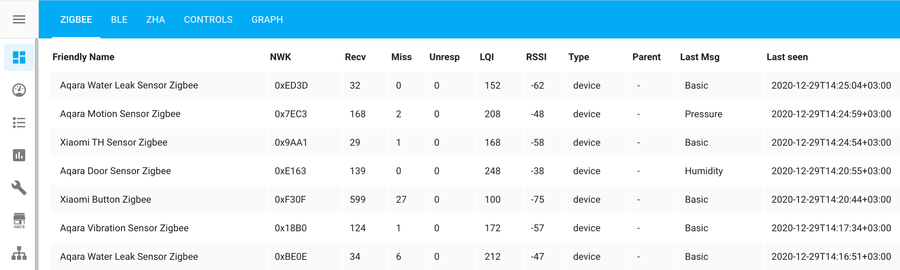
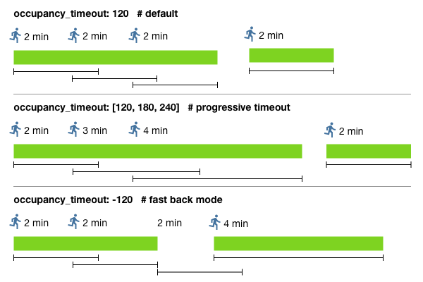
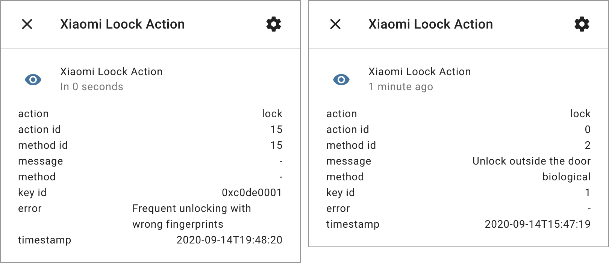

# Xiaomi Gateway 3 for Home Assistant

[](https://github.com/custom-components/hacs)
[](https://www.buymeacoffee.com/AlexxIT)
[](https://yoomoney.ru/to/41001428278477)

Control Zigbee devices from Home Assistant with **Xiaomi Gateway 3 (ZNDMWG03LM and ZNDMWG02LM)** on original firmware.

Gateway support **Zigbee 3**, **Bluetooth Mesh** and **HomeKit**.

This method does not change the device firmware. Gateway continues to work with Mi Home and HomeKit.

**Real [user](https://github.com/to4ko/myconfig) config with 3 Gateways**


Thanks to [@Serrj](https://community.home-assistant.io/u/serrj-sv/) for [instruction](https://community.home-assistant.io/t/xiaomi-mijia-smart-multi-mode-gateway-zndmwg03lm-support/159586/61) how to enable Telnet on old firmwares. And thanks to an unknown researcher for [instruction](https://gist.github.com/zvldz/1bd6b21539f84339c218f9427e022709) how to open telnet on new firmwares.

**Important:** This component does not work with:
 - Xiaomi Gateway 2 (DGNWG02LM, lumi.gateway.v3) - use [this](https://www.home-assistant.io/integrations/xiaomi_aqara/) component
 - Xiaomi Gateway EU (DGNWG05LM, lumi.gateway.mieu01)

**Attention:** The component is under active development. Breaking changes may appear.

# Table of Contents

- [FAQ](#faq)
- [Supported Firmwares](#supported-firmwares)
- [Supported Zigbee Devices](#supported-zigbee-devices)
- [Supported BLE Devices](#supported-ble-devices)
- [Supported Bluetooth Mesh Devices](#supported-bluetooth-mesh-devices)
- [Installation](#installation)
- [Configuration](#configuration)
- [Zigbee and BLE performance table](#zigbee-and-ble-performance-table)
- [Advanced config](#advanced-config)
- [Add and remove Zigbee devices](#add-and-remove-zigbee-devices)
- [Add third-party Zigbee devices](#add-third-party-zigbee-devices)
- [Zigbee Home Automation Mode](#zigbee-home-automation-mode)
- [Zigbee2MQTT Mode](#zigbee2mqtt-mode)
- [Handle Button Actions](#handle-button-actions)
- [Handle BLE Locks](#handle-ble-locks)
- [Obtain Mi Home device token](#obtain-mi-home-device-token)
- [Disable Buzzer](#disable-buzzer)
- [Advanced commands](#advanced-commands)
- [How it works](#how-it-works)
- [Debug mode](#debug-mode)
- [Useful links](#userful-links)

# FAQ

**Q. Can Xiaomi close support for this integration in firmware updates?**  
A. Yes, they can and are already doing it. But if you have a worked hub and you do not update it, it will continue to work. Component can block fw updates with **Lock Firmware** switch.

**Q. Does this integration support hubs DGNWG02LM, DGNWG05LM, Aqara Hub...?**  
A. No. The integration only supports ZNDMWG03LM (China version) and ZNDMWG02LM (Euro version).

**Q. Does this integration support Xiaomi Robot Vacuum, Xiaomi Philips Bulb...?**  
A. No. The integration does not support Xiaomi Wi-Fi devices.

**Q. Does the integration work without internet?**  
A. Partially. The component connects to a hub on the local network. Zigbee devices work without internet. But adding new Zigbee devices to Mi Home requires Internet. Updating BLE device data may not work without Internet.

**Q. Does the integration support non Xiaomi Zigbee devices?**  
A. Yes. There are three ways to connect third party Zigbee devices. All methods have a different set of supported devices. There is no exact supported list. Don't expect absolutely every device on the market to be supported in any of these methods.

**Q. Will the Zigbee devices continue to work in Mi Home?**  
A. Yes. If you do not enable ZHA or z2m mode, the devices will continue to work in Mi Home. And you can use automation in both Mi Home and Hass.

**Q. Do I need to receive a token or enable Telnet manually?**  
A. No. The token is obtained automatically using the login / password from the Mi Home account. Telnet turns on automatically using token.

**Q. Should I open or solder the hub?**  
A. No. Read [supported firmwares](#supported-firmwares) section.

**Q. Should I use ZHA or z2m mode?**  
A. You decide. If all of your Zigbee devices are supported in Mi Home, it is best to use it. If you have two hubs - you can use one of them in Mi Home mode, and the second in ZHA or z2m mode. Or you can also use the hub in Mi Home mode with Xiaomi devices and a Zigbee USB Dongle for other Zigbee devices.

**Q. How many Zigbee devices does the hub support?**  
A. The hub can connect directly up to 32 battery-powered devices (end devices). And **additionaly** up to 26 powered devices (routers). Other devices on your network can work through routers. The maximum number of devices is unknown. Official Xiaomi documentation writes about 128 devices.

**Q. Does the component support decoupled mode for switches?**  
A. Yes, but it needs to be turned on in the Mi Home app.

**Q. Why does the two-button switch only have one entity action?**  
A. All button clicks are displayed in the status of that one entity.

# Supported Firmwares

The component is only tested with these firmware versions:

- v1.4.6_0012 - you may use default open telnet command
- v1.5.0_0026 - you **should** use [custom open telnet command](https://gist.github.com/zvldz/1bd6b21539f84339c218f9427e022709), safe to update

If you have problems with other firmware, don't even ask to fix it.

The component can work with these firmware versions, but they may have bugs: v1.4.4_0003, v1.4.5_0012, v1.4.5_0016, v1.4.6_0030, v1.4.6_0043, v1.4.7_0063, v1.4.7_0065, v1.4.7_0115, v1.4.7_0160.

Optionally you can flash gateway with custom firmware: [wiki](https://github.com/AlexxIT/XiaomiGateway3/wiki).

Component can block fw updates with **Lock Firmware** switch. Mi Home app will continue to offer you update. But won't be able to install it. It should fail at 0%.

[](https://www.youtube.com/watch?v=9BMoKq19yCI)

# Supported Zigbee Devices

Tested Devices:
- Aqara Bulb (ZNLDP12LM)
- Aqara Button (WXKG11LM)
- Aqara Cube (MFKZQ01LM)
- Aqara Curtain (ZNCLDJ11LM)
- Aqara Curtain B1 (ZNCLDJ12LM)
- Aqara Door Lock S1 (ZNMS11LM)
- Aqara Door Lock S2 (ZNMS12LM)
- Aqara Door Lock S2 Pro (ZNMS12LM)
- Aqara Door Sensor (MCCGQ11LM)
- Aqara Double Wall Button (WXKG02LM)
- Aqara Double Wall Button D1 (WXKG07LM)
- Aqara Double Wall Switch (QBKG03LM,QBKG12LM)
- Aqara Double Wall Switch D1 (QBKG22LM,QBKG24LM)
- Aqara Motion Sensor (RTCGQ11LM)
- Aqara Opple Four Button (WXCJKG12LM)
- Aqara Opple MX480 (XDD13LM)
- Aqara Opple MX650 (XDD12LM)
- Aqara Opple Six Button (WXCJKG13LM)
- Aqara Opple Two Button (WXCJKG11LM)
- Aqara Precision Motion Sensor (RTCGQ13LM)
- Aqara Relay (LLKZMK11LM)
- Aqara Relay T1 (SSM-U01,SSM-U02)
- Aqara Roller Shade (ZNGZDJ11LM)
- Aqara Shake Button (WXKG12LM)
- Aqara Single Wall Button (WXKG03LM)
- Aqara Single Wall Button D1 (WXKG06LM)
- Aqara Single Wall Switch (QBKG04LM,QBKG11LM)
- Aqara Single Wall Switch D1 (QBKG21LM,QBKG23LM)
- Aqara Socket (QBCZ11LM)
- Aqara TH Sensor (WSDCGQ11LM,WSDCGQ12LM)
- Aqara Thermostat S2 (KTWKQ03ES)
- Aqara Triple Wall Switch D1 (QBKG25LM,QBKG26LM)
- Aqara Vibration Sensor (DJT11LM)
- Aqara Water Leak Sensor (SJCGQ11LM)
- Honeywell Gas Sensor (JTQJ-BF-01LM/BW)
- Honeywell Smoke Sensor (JTYJ-GD-01LM/BW)
- IKEA Bulb E14 (LED1649C5)
- IKEA Bulb E14 400 lm (LED1536G5)
- IKEA Bulb E27 1000 lm (LED1623G12)
- IKEA Bulb E27 950 lm (LED1546G12)
- IKEA Bulb E27 980 lm (LED1545G12)
- IKEA Bulb GU10 400 lm (LED1537R6,LED1650R5)
- Xiaomi Button (WXKG01LM)
- Xiaomi Door Sensor (MCCGQ01LM)
- Xiaomi Light Sensor (GZCGQ01LM)
- Xiaomi Motion Sensor (RTCGQ01LM)
- Xiaomi Plug (ZNCZ02LM)
- Xiaomi Plug EU (ZNCZ04LM)
- Xiaomi Plug TW (ZNCZ03LM)
- Xiaomi Plug US (ZNCZ12LM)
- Xiaomi TH Sensor (WSDCGQ01LM)

# Supported BLE Devices

**Video DEMO**

[](https://www.youtube.com/watch?v=4D_vqvUre_0)

Tested Devices:
- Aqara Door Lock N100 (ZNMS16LM)
- Aqara Door Lock N200 (ZNMS17LM)
- Xiaomi Alarm Clock (CGD1)
- Xiaomi Door Sensor 2 (MCCGQ02HL)
- Xiaomi Flower Care (HHCCJCY01)
- Xiaomi Magic Cube (XMMF01JQD)
- Xiaomi Mosquito Repellent (WX08ZM)
- Xiaomi Motion Sensor 2 (RTCGQ02LM)
- Xiaomi Night Light 2 (MJYD02YL-A)
- Xiaomi Qingping TH Sensor (CGG1)
- Xiaomi Safe Box (BGX-5/X1-3001)
- Xiaomi TH Clock (LYWSD02MMC)
- Xiaomi TH Sensor (LYWSDCGQ/01ZM)
- Xiaomi TH Sensor 2 (LYWSD03MMC)
- Xiaomi ZenMeasure Clock (MHO-C303)
- Yeelight Button S1 (YLAI003)

XMMF01JQD don't sends edge info, only direction!

Other BLE devices also maybe supported...

Kettles and scooters are not BLE devices. It is not known whether the gateway can work with them. Currently not supported.

BLE devices and their attributes **don't appear immediately**! Data collected and stored at the gateway. After rebooting Hass - data restored from the gateway. Rebooting the gateway will clear the saved data!

# Supported Bluetooth Mesh Devices

Tested Mesh Lights:
- Xiaomi Mesh Bulb (MJDP09YL)
- Xiaomi Mesh Downlight (MJTS01YL)
- Xiaomi Mesh Group (Mesh Group)
- Yeelight Mesh Bulb E14 (YLDP09YL)
- Yeelight Mesh Bulb E27 (YLDP10YL)
- Yeelight Mesh Bulb M2 (YLDP25YL/YLDP26YL)
- Yeelight Mesh Downlight (YLSD01YL)
- Yeelight Mesh Downlight M2 (YLTS02YL/YLTS04YL)
- Yeelight Mesh Spotlight (YLSD04YL)

Tested Mesh Switches:
- PTX Mesh Wall Double Switch (PTX-SK2M)
- PTX Mesh Wall Single Switch (PTX-SK1M)
- PTX Mesh Wall Triple Switch (PTX-TK3/M)
- Xiaomi Mesh Wall Double Switch (DHKG02ZM)

Other Mesh devices also maybe supported...

# Installation

**Video DEMO**

[](https://www.youtube.com/watch?v=CQVSFISC9CE)

**Method 1.** [HACS](https://hacs.xyz/):

> HACS > Integrations > Plus > **XiaomiGateway3** > Install

**Method 2.** Manually copy `xiaomi_gateway3` folder from [latest release](https://github.com/AlexxIT/XiaomiGateway3/releases/latest) to `/config/custom_components` folder.

# Configuration

**Video DEMO**

[](https://www.youtube.com/watch?v=rU_ATCVKx78)

> Configuration > Integrations > Add Integration > **Xiaomi Gateway3 **

If the integration is not in the list, you need to clear the browser cache.

# Zigbee and BLE performance table



1. To enable stats sensors go to:

   > Configuration > Integrations > Xiaomi Gateway 3 > Options > Zigbee and BLE performance data
   
   Optional you can enable pereodical updates about device parent routers.
   
   > Configuration > Integrations > Xiaomi Gateway 3 > Options > Parent devices in stats: Hourly
   
2. Install [Flex Table](https://github.com/custom-cards/flex-table-card) from HACS

3. Add new Lovelace tab with **Panel Mode**

4. Add new Lovelace card:
   - [example 1](https://gist.github.com/AlexxIT/120f20eef4f39071e67f698207490db9)
   - [example 2](https://github.com/avbor/HomeAssistantConfig/blob/master/lovelace/views/vi_radio_quality_gw3.yaml)

How it works:

- for each Zigbee and BLE device, a sensor will be created with the time of receiving the last message from this sensor
- there will also be a lot of useful information in the sensor attributes
- for the Gateway, the sensor state shows the uptime of the gateway connection, so you can check the stability of your Wi-Fi
- the `uptime` in gateway sensor attributes means time after reboot gateway
- the `msg_missed` may not always show correct data if you reboot the gate or device
- dash in the `type` means that the device is not directly connected to the hub
- the `parent` can be updated within a few hours

# Advanced config

Support custom occupancy timeout for motion sensor and invert state for door sensor (for DIY purposes).

Config through built-in [customizing](https://www.home-assistant.io/docs/configuration/customizing-devices/) UI or YAML.

[](https://www.youtube.com/watch?v=2EeKnF2uvjo)

It's important to add these lines to your `configuration.yaml`. Otherwise, changes to the UI will not be read when you restart Home Assistant.

```yaml
homeassistant:
  customize: !include customize.yaml
```

To enable customizing UI, you need to enable **Advanced Mode** in your user profile.

**Occupancy timeout** for moving sensor.



- a **simple timer** starts every time a person moves
- the **progressive timer** starts with a new value with each new movement of the person, the more you move - the longer the timer
- **fast back timer** starts with doubled value if the person moves immediately after the timer is off

```yaml
# /config/customize.yaml
binary_sensor.0x158d0003456789_motion:
  occupancy_timeout: 180  # simple mode
binary_sensor.0x158d0003456788_motion:
  occupancy_timeout: -120  # fast back mode
binary_sensor.0x158d0003456787_motion:
  occupancy_timeout: [-120, 240, 300]  # progressive timer
binary_sensor.0x158d0003456786_motion:
  occupancy_timeout: 1  # for hacked 5 sec sensors
```

**Invert state** for contact sensor.

```yaml
# /config/customize.yaml
binary_sensor.0x158d0003456789_contact:
  invert_state: 1  # any non-empty value will reverse the logic
```

**Ignore offline** device status.

```yaml
# /config/customize.yaml
switch.0x158d0003456789_switch:
  ignore_offline: 1  # any non-empty value
```

**Zigbee bulb default transition**.

```yaml
light.0x86bd7fffe000000_light:
  default_transition: 5
```

# Add and remove Zigbee devices

To enter the pairing mode, turn on the switch **Xiaomi Gateway 3 Pair**. Pairing lasts 60 seconds.

After successfully adding the device, the Gateway will sound two long beeps.

If the addition was unsuccessful, for example, an unsupported device, the Gateway will sound three short beeps.

To delete a device from Hass and from Gateway - you need to rename device to **delete**. Just the device, not its objects!

# Add third-party Zigbee devices

**Video DEMO**

[](https://www.youtube.com/watch?v=hwtBPMtMnKo)

**Attention 1:** Only devices similar to Xiaomi devices will work!

**Attention 2:** After the first pairing, Mi Home remembers the selected device model. And with the next pairings, it will show old interface, even if you change the model. Hass will take the new device model on the next pairings.

To add a custom device, you need to call the service `remote.send_command` with params:

```yaml
entity_id: remote.0x680ae2fffe123456_pair  # change to your Gateway remote
command: pair
device: ikea.light.led1623g12  # change to your device model
```

You need to choose the most similar Xiaomi model for your device from [this file](https://github.com/AlexxIT/XiaomiGateway3/blob/master/custom_components/xiaomi_gateway3/core/utils.py).

For example, for a lamp or dimmer - choose an IKEA lamp `ikea.light.led1623g12`.

Sometimes it doesn't work the first time and you need to try pairing again.

The devices added in this way will work even after the Gateway is restarted. They will continue to work without Hass. And they can be used in Mi Home automations.

You can discuss the feature [here](https://github.com/AlexxIT/XiaomiGateway3/issues/44).

# Zigbee Home Automation Mode

**Video DEMO**

[](https://www.youtube.com/watch?v=AEkiUK7wGbs)

[Zigbee Home Automation](https://www.home-assistant.io/integrations/zha/) (ZHA) is a standard Home Assistant component for managing Zigbee devices. It works with various radio modules such as CC2531, Conbee II, Tasmoted Sonoff ZBBridge and others.

**Important:** ZHA component is in active development stage. Don't expect it to work well with all devices.

**Attention: ZHA mode cannot work simultaneously with Mi Home!**

When you turn on ZHA mode - zigbee devices in Mi Home will stop working. Bluetooth devices will continue to work.

To switch the mode go to:

> Configuration > Integrations > Xiaomi Gateway 3 > Options > Mode

Zigbee devices will not migrate from Mi Home to ZHA. You will need to pair them again with ZHA.

You can change the operating mode at any time. Your gateway firmware does not change! Just reboot the gateway and it is back in stock.

Thanks to [@zvldz](https://github.com/zvldz) for help with [socat](http://www.dest-unreach.org/socat/).

# Zigbee2MQTT Mode

**Video DEMO**

[](https://www.youtube.com/watch?v=esJ0nsqjejc)

[Zigbee2MQTT](https://www.zigbee2mqtt.io/) is a bigest project that support [hundreds](https://www.zigbee2mqtt.io/information/supported_devices.html) Zigbee devices from different vendors. And can be integrate with a lot of home automation projects.

Unlike the ZHA you should install to your host or Hass.io system: [Mosquitto broker](https://github.com/home-assistant/addons/tree/master/mosquitto) and [Zigbee2MQTT Addon](https://github.com/zigbee2mqtt/hassio-zigbee2mqtt). Also you should setup [MQTT](https://www.home-assistant.io/integrations/mqtt/) integration.

**Attention: Zigbee2MQTT mode cannot work simultaneously with Mi Home!**

When you turn on Zigbee2MQTT mode - zigbee devices in Mi Home will stop working. Bluetooth devices will continue to work.

To switch the mode go to:

> Configuration > Integrations > Xiaomi Gateway 3 > Options > Mode

Zigbee devices will not migrate from Mi Home to Zigbee2MQTT. You will need to pair them again.

This mode will flash firmware of Gateway Zigbee chip automatically! And flash it back when you switch back to Mi Home mode. Becuse Zigbee2MQTT support only [new EZSP firmware](https://github.com/Koenkk/zigbee-herdsman/pull/317) and Xiaomi works with old one.

You can use this mode with thank to this peoples:

- [@kirovilya](https://github.com/kirovilya) and [@G1K](https://github.com/G1K) - developed support EFR32 chips in z2m project
- [@CODeRUS](https://github.com/CODeRUS) and [@zvldz](https://github.com/zvldz) - adapted the script to flash the chip
- [@faronov](https://github.com/faronov) - complied a new version of firmware 

# Handle Button Actions

**Video DEMO**

[](https://www.youtube.com/watch?v=a8hsNlTErac)

Buttons, vibration sensor, cube, locks and other - create an action entity. The entity changes its **state** for a split second and returns to an empty state. The **attributes** contain useful data, they are not cleared after the event is triggered.

Depending on the button model, its state may be:
- single button: `single`, `double`, `triple`, `quadruple`, `many`, `hold`, `release`, `shake`
- double button: `button_1_single`, `button_2_single`, `button_both_single`, etc.
- triple button: `button_1_single`, `button_12_single`, `button_23_single`, etc.

Your button may not have all of these options! Check available values in `action`-sensor attributes when you interact with button.

```yaml
automation:
- alias: Turn off all lights
  trigger:
  - platform: state
    entity_id: sensor.0x158d0002fa99fd_action  # change to your button
    to: button_1_single  # change to your button state
  action:
  - service: light.turn_off
    entity_id: all
  mode: single
```

# Handle BLE Locks



BLE locks have an action entity, just like buttons.

The state changes to `door`, `lock`, `fingerprint`,` armed` when an event occurs. Details of the event are in the entity attributes.

`action`: **fingerprint**
- `key_id` - Key ID in full hex format
- `action_id`: 0, `message`: Match successful
- `action_id`: 1, `message`: Match failed
- `action_id`: 2, `message`: Timeout
- `action_id`: 3, `message`: Low quality
- `action_id`: 4, `message`: Insufficient area
- `action_id`: 5, `message`: Skin is too dry
- `action_id`: 5, `message`: Skin is too wet

`action`: **door**
- `action_id`: 0, `message`: Door is open
- `action_id`: 1, `message`: Door is closed
- `action_id`: 2, `message`: Timeout is not closed
- `action_id`: 3, `message`: Knock on the door
- `action_id`: 4, `message`: Breaking the door
- `action_id`: 5, `message`: Door is stuck

`action`: **lock**
- `key_id` - Key ID in short decimal format
- `action_id`: 0, `message`: Unlock outside the door
- `action_id`: 1, `message`: Lock
- `action_id`: 2, `message`: Turn on anti-lock
- `action_id`: 3, `message`: Turn off anti-lock
- `action_id`: 4, `message`: Unlock inside the door
- `action_id`: 5, `message`: Lock inside the door
- `action_id`: 6, `message`: Turn on child lock
- `action_id`: 7, `message`: Turn off child lock
- `method_id`: 0, `method`: bluetooth
- `method_id`: 1, `method`: password
- `method_id`: 2, `method`: biological
- `method_id`: 3, `method`: key
- `method_id`: 4, `method`: turntable
- `method_id`: 5, `method`: nfc
- `method_id`: 6, `method`: one-time password
- `method_id`: 7, `method`: two-step verification
- `method_id`: 8, `method`: coercion
- `method_id`: 10, `method`: manual
- `method_id`: 11, `method`: automatic
- `key_id`: 0xc0de0000, `error`: Frequent unlocking with incorrect password
- `key_id`: 0xc0de0001, `error`: Frequent unlocking with wrong fingerprints
- `key_id`: 0xc0de0002, `error`: Operation timeout (password input timeout)
- `key_id`: 0xc0de0003, `error`: Lock picking
- `key_id`: 0xc0de0004, `error`: Reset button is pressed
- `key_id`: 0xc0de0005, `error`: The wrong key is frequently unlocked
- `key_id`: 0xc0de0006, `error`: Foreign body in the keyhole
- `key_id`: 0xc0de0007, `error`: The key has not been taken out
- `key_id`: 0xc0de0008, `error`: Error NFC frequently unlocks
- `key_id`: 0xc0de0009, `error`: Timeout is not locked as required
- `key_id`: 0xc0de000a, `error`: Failure to unlock frequently in multiple ways
- `key_id`: 0xc0de000b, `error`: Unlocking the face frequently fails
- `key_id`: 0xc0de000c, `error`: Failure to unlock the vein frequently
- `key_id`: 0xc0de000d, `error`: Hijacking alarm
- `key_id`: 0xc0de000e, `error`: Unlock inside the door after arming
- `key_id`: 0xc0de000f, `error`: Palmprints frequently fail to unlock
- `key_id`: 0xc0de0010, `error`: The safe was moved
- `key_id`: 0xc0de1000, `error`: The battery level is less than 10%
- `key_id`: 0xc0de1001, `error`: The battery is less than 5%
- `key_id`: 0xc0de1002, `error`: The fingerprint sensor is abnormal
- `key_id`: 0xc0de1003, `error`: The accessory battery is low
- `key_id`: 0xc0de1004, `error`: Mechanical failure

Write me if the values are wrong somewhere. I translated from Chinese [documentation](https://iot.mi.com/new/doc/embedded-development/ble/object-definition).

Example of several automations:

```yaml
automation:
- alias: Doorbell
  trigger:
    platform: state
    entity_id: sensor.ble_1010274797_action
    to: door
  condition:
    condition: template
    value_template: "{{ trigger.to_state.attributes['action_id'] == 3 }}"
  action:
    service: persistent_notification.create
    data_template:
      title: Doorbell
      message: The doorbell is ringing

- alias: Lock Error
  trigger:
    platform: state
    entity_id: sensor.ble_1010274797_action
    to: lock
  condition:
    condition: template
    value_template: "{{ trigger.to_state.attributes['error'] }}"
  action:
    service: persistent_notification.create
    data_template:
      title: Lock ERROR
      message: "{{ trigger.to_state.attributes['error'] }}"

- alias: Open lock
  trigger:
    platform: state
    entity_id: sensor.ble_1010274797_action
    to: lock
  condition:
    condition: template
    value_template: "{{ trigger.to_state.attributes['action_id'] == 0 }}"
  action:
    service: persistent_notification.create
    data_template:
      title: Lock is open
      message: |
        Opening method: {{ trigger.to_state.attributes['method'] }}
        User ID: {{ trigger.to_state.attributes['key_id'] }}
```

# Obtain Mi Home device token

**Video DEMO**

[](https://www.youtube.com/watch?v=rU_ATCVKx78)

You can use this integration to **get a token for any of your Xiaomi devices**. You don't need to have Xiaomi Gateway 3. Just install and add the integration, enter the username / password from your Mi Home account. And use the integration settings to view your account's device tokens.

Also you can get:

- **LAN key** for old [Xiaomi Mijia Gateway](https://www.home-assistant.io/integrations/xiaomi_aqara/) (lumi.gateway.v3)
- **room names** for Vacuums that support room with names
- **Bindkey** for BLE devices that has it


# Disable Buzzer

If you have a hacked motion sensor, the gateway will beep periodically.

The gateway has an application that handle the **button, LED and beeper**. This option can turn off this application.

**Attention:** I don't know what else this app does and will the gateway work fine without it.

To disable buzzer:

> Configuration > Integrations > Xiaomi Gateway 3 > Options > Disable buzzer

# Advanced commands

**Reboot Gateway**

```yaml
script:
  reboot_gateway:
    sequence:
    - service: remote.send_command
      entity_id: remote.0x0123456789abcdef_pair  # change to your gateway
      data:
        command: reboot
```

**Attention:** I don’t know if it’s safe to change the channel and power of the gateway. Use at your own risk.

The information in the attributes of the pair object is updated within a minute!

**Change Zigbee channel**

```yaml
command: channel 15  # I saw values: 11, 15, 20, 25
```

**Change Zigbee TX power**

```yaml
command: power 7  # I saw values: 0, 7, 30
```

# How it works

The component enables **Telnet** on Gateway via [Miio protocol](https://github.com/rytilahti/python-miio). Only this Gateway supports this command. Do not try to execute it on other Xiaomi/Aqara Gateways.

The component starts the **MQTT Server** on the public port of the Gateway. All the logic in the Gateway runs on top of the built-in MQTT Server. By default, access to it is closed from the outside.

**ATTENTION:** Telnet and MQTT work without a password! Do not use this method on public networks.

After rebooting the device, all changes will be reset. The component will launch Telnet and public MQTT every time it detects that they are disabled.

# Debug mode

Component support debug mode. Shows only component logs. The link to the logs is always random and will apear in Notifications.

> Configuration > Integrations > Xiaomi Gateway 3 > Options > Debug

You can filter data in the logs, enable auto refresh (in seconds) and tail last lines.

```
http://192.168.1.123:8123/c4e99cfc-0c83-4a39-b7f0-278b0e719bd1?q=ble_event&r=2&t=100
```

# Useful links

- [Russian Telegram Community](https://t.me/xiaomi_gw_v3_hack)
- [Italian Telegram Community](https://t.me/HassioHelp)
- [Russian video about instal integration](https://youtu.be/FVWfjE5tx2g)
- [Russian article about flash gateway](https://simple-ha.ru/posts/261)
- [Home Assistant Community](https://community.home-assistant.io/t/xiaomi-mijia-smart-multi-mode-gateway-zndmwg03lm-support/159586)
